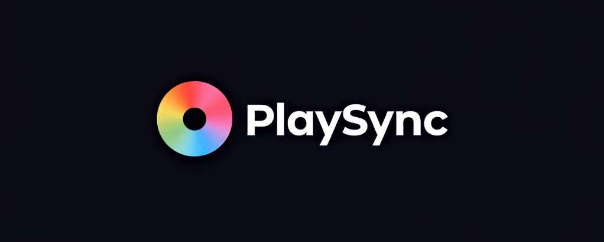

# PlaySync - Multi-Platform Playlist Tool



**PlaySync** is a micro terminal application that lets you manage playlists across Spotify, Apple Music, and YouTube Music. Convert playlists between platforms, merge them into a single unique list, or compare them to find common and unique tracks—all from the comfort of your command line.

## Features

### Core Functions
- **Convert Playlists**: Transfer a playlist from one platform (e.g., Spotify) to the others (e.g., Apple Music and YouTube Music).
- **Merge Playlists**: Combine playlists from multiple platforms into one, deduplicating tracks based on name and artist.
- **Compare Playlists**: Analyze playlists to identify tracks common across all platforms and those unique to each.

### Advanced Features
- **Playlist Analysis**: Get detailed statistics including audio features, top artists, genres, and duration analysis
- **Export/Import**: Export playlists in JSON, CSV, or TXT formats and import from JSON files
- **Playlist Management**: Delete, rename, duplicate, and manage playlists across platforms
- **Search & Recommendations**: Search tracks, create playlists from search results, and get personalized recommendations
- **Batch Operations**: Convert multiple playlists simultaneously and sync playlists across platforms
- **Smart Playlists**: Create playlists based on complex criteria and filters
- **Backup System**: Complete backup and restore functionality for all playlists
- **Audio Features Analysis**: Compare tempo, energy, danceability, and other audio characteristics

## Prerequisites

- Python 3.9+
- API credentials for Spotify, Apple Music, and YouTube Music (see [Setup](#setup)).

## Setup

1. **Clone the Repository**
   ```bash
   git clone https://github.com/makalin/PlaySync.git
   cd PlaySync
   ```

2. **Install Dependencies**
   ```bash
   pip install -r requirements.txt
   ```
   Dependencies include:
   - `spotipy` (Spotify API)
   - `requests` (Apple Music API)
   - `ytmusicapi` (YouTube Music API)
   - `python-dotenv` (environment variable management)

3. **Configure Environment Variables**
   Create a `.env` file in the root directory with the following:
   ```plaintext
   SPOTIFY_CLIENT_ID=your_spotify_client_id
   SPOTIFY_CLIENT_SECRET=your_spotify_client_secret
   APPLE_MUSIC_DEV_TOKEN=your_apple_music_dev_token
   APPLE_MUSIC_USER_TOKEN=your_apple_music_user_token
   YOUTUBE_AUTH_FILE=path/to/youtube_auth.json
   ```
   - **Spotify**: Get credentials from the [Spotify Developer Dashboard](https://developer.spotify.com/dashboard/).
   - **Apple Music**: Obtain tokens via the [Apple Developer Program](https://developer.apple.com/programs/). See [Apple Music API docs](https://developer.apple.com/documentation/applemusicapi).
   - **YouTube Music**: Generate `youtube_auth.json` by running `ytmusicapi setup` (see [ytmusicapi setup guide](https://ytmusicapi.readthedocs.io/en/stable/setup.html)).

4. **Run the App**
   ```bash
   python main.py
   ```
   Follow the interactive terminal prompts to select an action and provide playlist details.

## Usage

### Main Menu
Upon running `main.py`, you’ll see:
```
Welcome to PlaySync - Playlist Converter, Merger, and Comparer
Options:
1. Convert playlist to other platforms
2. Merge playlists from multiple platforms
3. Compare playlists across platforms
4. Exit
Enter your choice (1-4):
```

### Examples

1. **Convert a Playlist**
   - Choose "1".
   - Input: Source platform = `Spotify`, URL = `https://open.spotify.com/playlist/37i9dQZF1DXcBWIGoYBM5M`.
   - Result: Creates identical playlists on Apple Music and YouTube Music.

2. **Merge Playlists**
   - Choose "2".
   - Include playlists from Spotify and YouTube Music (e.g., `PLAXYZ123` for YouTube).
   - Target platform = `Spotify`.
   - Result: A single Spotify playlist with unique tracks from both sources.

3. **Compare Playlists**
   - Choose "3".
   - Input playlists from all three platforms.
   - Output: Lists common tracks (e.g., "Shape of You by Ed Sheeran") and unique tracks per platform.

### Playlist Identifiers
- **Spotify**: URL like `https://open.spotify.com/playlist/XXXXX`.
- **Apple Music**: Library playlist ID like `p.XXXXX` (from URL or library).
- **YouTube Music**: Playlist ID like `PLXXXXX` (from URL).

## Project Structure

```
PlaySync/
├── main.py              # Terminal app entry point with advanced menu system
├── spotify_client.py    # Enhanced Spotify API client with analysis tools
├── apple_client.py      # Enhanced Apple Music API client with analysis tools
├── youtube_client.py    # Enhanced YouTube Music API client with analysis tools
├── utils.py             # Advanced utilities for batch operations and analysis
├── requirements.txt     # Dependencies
├── README.md            # This file
├── FUNCTIONS.md         # Comprehensive function documentation
└── .github/workflows/   # Optional GitHub Actions
```

## Limitations

- **Song Matching**: Uses basic name/artist matching. For production, implement ISRC-based matching for accuracy.
- **Apple Music**: Track addition is simulated due to API complexity; full integration requires catalog ID lookup.
- **Error Handling**: Minimal; enhance for robustness in real-world use.

## Contributing

Contributions are welcome! To contribute:
1. Fork the repository.
2. Create a feature branch (`git checkout -b feature/awesome-feature`).
3. Commit changes (`git commit -m "Add awesome feature"`).
4. Push to the branch (`git push origin feature/awesome-feature`).
5. Open a Pull Request.

Please include tests and update documentation where applicable.

## Future Enhancements

- Add ISRC-based song matching for precise conversions.
- Implement a web or GUI interface (e.g., Flask or Tkinter).
- Support additional platforms (e.g., Deezer, Tidal).
- Machine learning integration for AI-powered playlist generation.
- Real-time synchronization across platforms.
- Advanced audio feature analysis and visualization.
- Social features for playlist sharing and collaboration.

## License

This project is licensed under the MIT License - see the [LICENSE](LICENSE) file for details (create one if needed).

## Acknowledgments

- Thanks to the open-source communities behind `spotipy`, `ytmusicapi`, and others.
